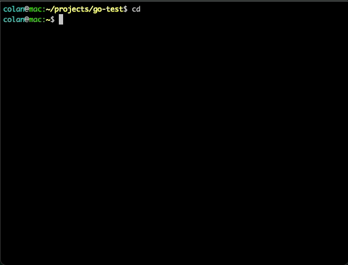

# go-test



This is inspired by [try](https://github.com/tobi/try/tree/main), a repo I came across and I thought to myself that I would like to use something like that. However, I am also in the process of learning [Go](https://go.dev/), and I was looking for a cool project to work on, and it seemed like a fun project to make myself. So, that's what this repo is, an alternative version of [try](https://github.com/tobi/try/tree/main), written in [Go](https://go.dev/).

## Supported Platforms

- Linux
- MacOS

## Running

```bash
go run *.go && cd `cat ~/.gotest`
```

## Installing

`cd` to whatever directory you want to clone the repo to.

```bash
git clone https://github.com/bi3mer/go-test.git
cd go-test
go build -o gotest *.go
echo "alias gotest='/Users/colan/projects/go-test/gotest && eval \"\$(cat ~/.gotest)\"; rm ~/.gotest'" >> ~/.bash_profile
```

You may use something other than `~/.bash_profile`, like `~/.zshrc` etc.

You should also set the environment variable `gotestdir` to wherever you want your test directory to be. You should use an absolute path or a relative one starting with `~`. (e.g., I use `export gotestdir="~/Library/CloudStorage/Dropbox/tests"`)

## Uninstalling

First, go to `~/bash_profile`, `~/.zshrc`, or wherever you modified to add the alias `gotest`. Remove that line from the file. Then, run the following:

```bash
rm ~/.gotestdb
rm ~/.gotest
```

`~/.gotest` shoudln't exist, but just in case.